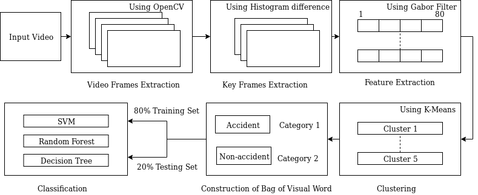

# CarCrash

Python based project to provide a Video Analysis method for Vehicular Accident Detection.

The rate of road accidents has increased to a large extent over the last few years with the rapid advancement of the automobile industry. Therefore, accurate and prompt detection of accidents offers tremendous benefits of saving properties and lives. Traffic accident detection employing Computer Vision, Image Processing and Machine Learning on freeways has attracted much attention recently. The judgment of whether an incident has happened or not is made using the behavioral abnormality of some continuous images. 
CarCrash prepares a trained model for the detection of vehicular accidents. This model can be then used to predict whether there is any accident in a given input video. The dataset is currently small, consisting of both accident and non-accident videos. Feel free to ask for the dataset -:)

## The System Flowchart

  

## Installations

This project requires Python and the following Python libraries installed:
* [NumPy](https://numpy.org/)
* [scikit-learn](https://scikit-learn.org/stable/)
* [FFmpeg-Python](https://pypi.org/project/ffmpeg-python/)
* [OpenCV](https://opencv.org/)
* [Matplotlib](https://matplotlib.org/)
 
Also Install [PySceneDetect](https://pyscenedetect.readthedocs.io/en/latest/download/).

## Running the project

Run the [VideoClipExtract.py](https://github.com/I-am-aman/CarCrash/blob/master/VideoClipExtract.py) file first which will prepare the CSV file of Bag of Visual Words. This is gonna take a lot of time, depending on the system specifications (You can also directly use the [feature_vector.csv](https://github.com/I-am-aman/CarCrash/blob/master/feature_vector.csv) and [label_vector.csv](https://github.com/I-am-aman/CarCrash/blob/master/label_vector.csv) files that is provided and skip this step). 
Then different classifiers can be simply run to train and test the model.
